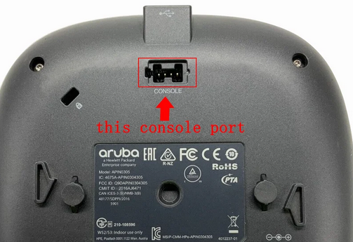

# Installation guide — Aruba IAP-305 → OpenWrt 24.10.7

## Prerequisites

- Aruba IAP-305-RW (or compatible variant)
- USB-TTL serial cable (3 wires: GND, RX, TX) for console access during the initial install
- A TFTP server reachable from the AP
- The two prebuilt AP-305 images from the [latest release](https://github.com/Fr4ctbyte/openwrt/releases/latest):
  - `openwrt-ipq40xx-generic-aruba_ap-305-initramfs-uImage.itb` — the **ramboot** image (TFTP RAM boot, step 3). **⚠️ This file must be renamed to `ipq40xx.ari` for the TFTP boot to work — APBoot only ever fetches that one name (see step 3).**
  - `openwrt-ipq40xx-generic-aruba_ap-305-squashfs-sysupgrade.bin` — the **base** image (flashed to NAND, step 5)

## Step 1 — Open serial console

The AP-305 exposes a **4-pin serial console header** on the underside of the unit, labelled **CONSOLE**:



You need a **USB-to-TTL serial adapter** (CP2102, FT232, CH340, etc.). 

Looking at the header with pin **1 on the left** and pin **4 on the right**:

```
        ┌─────┬─────┬─────┬─────┐
   pin  │  1  │  2  │  3  │  4  │
        ├─────┼─────┼─────┼─────┤
        │ GND │ RX  │ TX  │ NC  │
        └─────┴─────┴─────┴─────┘
   left ◄─────────────────────► right
```

| AP-305 pin | Signal | Connect to your USB-TTL adapter |
|:---:|:---:|:---:|
| 1 (left) | GND | GND |
| 2 | RX | **TX** |
| 3 | TX | **RX** |
| 4 (right) | NC (3.3 V) | **leave unconnected** |

It's a **crossover** connection: the AP's **RX (pin 2)** goes to your adapter's **TX**, and the AP's **TX (pin 3)** goes to your adapter's **RX**. (RX listens, TX talks — so each side's transmit feeds the other's receive.)

> ⚠️ **Don't connect pin 4.** It carries 3.3 V and isn't needed for the console. Wiring it can backfeed the board.

Open a serial terminal on the matching COM/tty port with these settings:

| Setting | Value |
|---|---|
| Baud rate | **9600** |
| Data bits | 8 |
| Parity | None |
| Stop bits | 1 |
| Flow control | None |

Power the AP. Press a key (or `Ctrl+C`) during the short countdown to interrupt autoboot and drop to the apboot prompt:

```
apboot>
```

This is the bootloader shell you'll drive for the rest of the install: steps 2–3 set up networking and TFTP RAM-boot the AP-305 image straight from here, without touching the flash.

## Step 2 — Configure U-Boot for TFTP

On a fresh AP, set up the ramboot variable:

```
apboot> setenv ramboot_openwrt "setenv ipaddr <ap-ip>; setenv serverip <tftp-server-ip>; netget; set fdt_high 0x87000000; bootm"
apboot> setenv bootfile ipq40xx.ari
apboot> setenv bootcmd "run ramboot_openwrt"
apboot> saveenv

# Optional: pin the kernel console to 9600 baud (so Linux boot logs print at the same speed as APBoot)
apboot> setenv bootargs console=ttyMSM1,9600n8
apboot> saveenv
```

Replace `<ap-ip>` with the static IP you want the AP to use (e.g., `192.168.1.250`), and `<tftp-server-ip>` with your TFTP server's IP. The `bootfile` is the filename APBoot will TFTP — `ipq40xx.ari` by convention; in step 3 you'll place the AP-305 ramboot image under that name.

## Step 3 — TFTP-boot the AP-305 ramboot image

Boot the AP-305 **ramboot** image (the initramfs from the release) entirely in RAM, leaving NAND untouched.

> ⚠️ **The downloaded file must be renamed to `ipq40xx.ari`.** APBoot fetches one fixed filename, the `bootfile` you set in step 2 (`ipq40xx.ari`), and nothing else. Left under its original `openwrt-...-initramfs-uImage.itb` name, the TFTP transfer fails with *file not found*.

On your TFTP server, copy the release initramfs to that exact name:

```sh
cp openwrt-ipq40xx-generic-aruba_ap-305-initramfs-uImage.itb /srv/tftp/ipq40xx.ari
```

Then RAM-boot it from APBoot by running the helper you saved in step 2:

```
apboot> run ramboot_openwrt
```

The AP boots OpenWrt in RAM with both radios up. NAND is untouched, so a power-cycle returns you to whatever is currently flashed.

## Step 4 — Once OpenWrt is running

Connect via Ethernet and browse to `http://192.168.1.1` (the default OpenWrt IP) to reach the OpenWrt web GUI (LuCI).


## Step 5 — Flash the AP-305 image to NAND

You're running the AP-305 image from RAM; nothing is on the flash yet. Flash the **base** image to NAND through LuCI:

1. In LuCI, open **System → Backup / Flash Firmware**.
2. Under **Flash new firmware image**, click **Flash image…** and choose `openwrt-ipq40xx-generic-aruba_ap-305-squashfs-sysupgrade.bin`.
3. **Uncheck "Keep settings"** (you're switching from the RAM image to the on-flash one).
4. Click **Continue**. LuCI writes the image to NAND and reboots the AP.

CLI equivalent over SSH: `sysupgrade -n /tmp/openwrt-ipq40xx-generic-aruba_ap-305-squashfs-sysupgrade.bin`.

The AP reboots after ~30 s. But APBoot's `bootcmd` is still set to TFTP-ramboot (from step 2), so it won't boot the freshly flashed NAND image on its own. Interrupt it at `apboot>` and finish with step 6.

## Step 6 — Configure U-Boot for permanent NAND boot

```
apboot> setenv nandboot_openwrt "ubi part aos1; ubi read 0x85000000 kernel; set fdt_high 0x87000000; bootm 0x85000000"
apboot> setenv bootcmd "run nandboot_openwrt"
apboot> saveenv
```

Now power-cycle the AP. It should boot straight into the new AP-305 OpenWrt.

## Step 7 — Verify everything works

Log into `http://192.168.1.1` (or via the serial console / SSH) and confirm the AP-305 image is up with both radios:

```sh
# Confirm you're running the AP-305 image:
cat /sys/firmware/devicetree/base/compatible
# Expected: aruba,ap-305

# Both radios present:
iw phy
# Expected: phy0 (2.4 GHz) and phy1 (5 GHz)

# Factory calibration read from ART:
dmesg | grep "pre-calibration data"
# Expected: "pre-calibration data from nvmem-cells: found" (AHB 2.4 GHz + PCIe 5 GHz)
``` 


## Recovery

If the AP doesn't come back after flashing, or you lose network access, interrupt the boot to land at `apboot>` (Ctrl+C during the countdown). First, check what each OS bank holds:

```
apboot> osinfo
```

`osinfo` lists the AP's two OS banks. On this AP they map like so:

| APBoot bank | NAND volume | mtd | Holds |
|:---:|:---:|:---:|---|
| 0 | `aos0` | mtd0 | ArubaOS (factory, left untouched) |
| 1 | `aos1` | mtd1 | OpenWrt (flashed in step 5) |

```
# Representative osinfo output:
Partition 0:  ArubaOS x.x.x.x      <- aos0 / mtd0  (factory)
Partition 1:  OpenWrt 24.10.7      <- aos1 / mtd1  (your install)
```

**Option 1 — get a working OpenWrt back.** If you only lost the boot config, re-boot OpenWrt from `aos1`:

```
apboot> run nandboot_openwrt
```

If the on-flash image itself is damaged, TFTP-ramboot a known-good image (same as step 3) and re-flash from RAM:

```
apboot> setenv bootfile ipq40xx.ari
apboot> run ramboot_openwrt
```

**Option 2 — return to stock ArubaOS.** ArubaOS is still intact on `aos0` (OpenWrt only ever touched `aos1`). The catch: APBoot's original ArubaOS `bootcmd` was overwritten when you set it to `run nandboot_openwrt` in step 6, and it isn't saved anywhere, so you have to restore it. Point APBoot back at bank 0 and at its native ArubaOS boot:

```
apboot> setenv os_partition 0
apboot> setenv bootcmd "boot ap"
apboot> saveenv
apboot> boot
```

## Hardware watchdog warning

The AP-305 has a hardware watchdog wired to **GPIO TLMM 3** that resets the board every ~60 s if not kicked. The DTS in this build configures Linux's `gpio-wdt` driver to kick it automatically (`hw_margin_ms = 1000`).

If your AP reboots periodically anyway, the pin might be different on your specific batch — see [docs/hardware.md](hardware.md) for alternatives (try TLMM 41, the AP-365 default, as fallback).
 